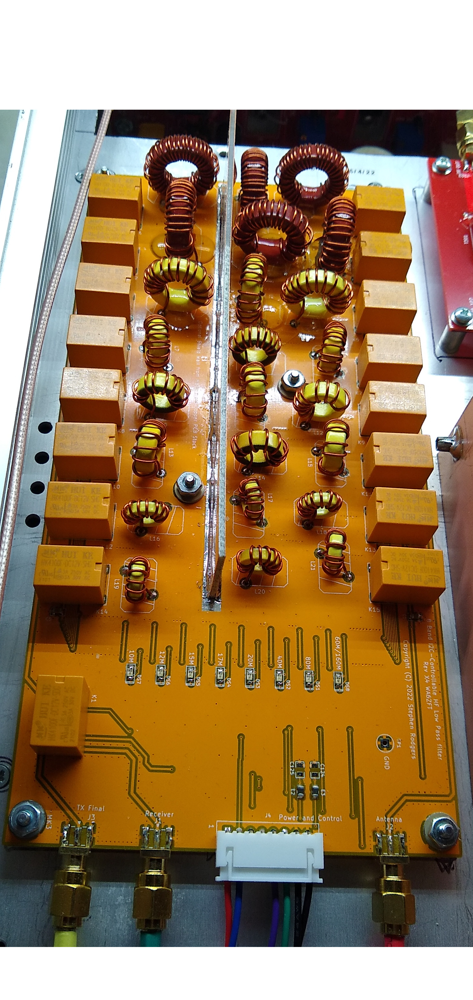

# Lefty-lp_filter
Lefty 8 Band Low Pass filter board

This is an 8 band low pass filter board for the Lefty Transceiver.

The schematic capture and pwb layout was originally done in KiCAD 5 and migrated to KiCAD 6.

The filters are individually selectable via an I2C port expander.

The filter topology used in the design is:

"Second-Harmonic Optimized Low Pass Filters" by Ed Wetherhold, W3NQN
https://www.arrl.org/files/file/Technology/tis/info/pdf/9902044.pdf

The pdf schematic file is: lp_filter_8_bands.pdf

The BOM file is: lp_filter_8_bands_BOM.csv

The gerber files are in the directory LPF_X4_FAB.

